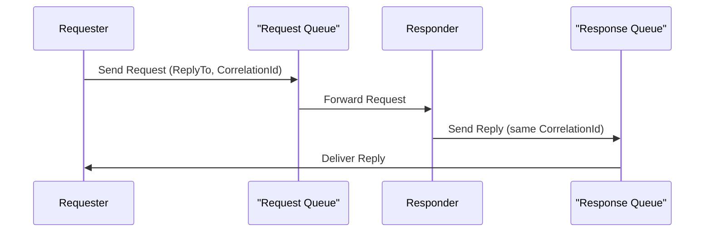

# Hands-on Lab: Request/Reply Messaging Pattern

## Overview

In this lab, you will build two C# console applications:

- **Requester**: The requester sends a request message (e.g., asking for the current time) to a request queue and waits for the corresponding reply message on a dedicated response queue.
- **Responder**: This listens to the request queue for incoming messages, processes them, and sends a reply message (with the current time) to the specified reply queue using the message's correlation identifier.

This demo mimics a typical enterprise scenario where a client makes a request and awaits a response in an asynchronous messaging environment.

---

## What is the Request/Reply Messaging Pattern?

The **Request/Reply Messaging Pattern** is a design approach used to facilitate synchronous interactions over an asynchronous message broker. Here is how it works:

- **Request Phase**: A client (the requester) sends a message to a designated request queue. This message includes:
  - A **ReplyTo** property: the address (or queue) where the client expects to receive the response.
  - A **CorrelationId**: a unique identifier that ties the request to its eventual response.
- **Response Phase**: A service (the responder) listens on the request queue, processes the incoming message, and then responds by sending a new message to the queue specified in the **ReplyTo** field. The responder copies the **CorrelationId** from the request into its response message.
- **Correlation**: When the requester receives the response, it uses the **CorrelationId** to match the response with the original request. This ensures that even if multipole request/response cycles are in progress, each reply can accurately correlate to its corresponding request.

Below is a sequence diagram that outlines this interaction:



**Key Benefits**:

- **Decoupling**: The requester and responder operate independently, which enhances scalability and resilience.
- **Asynchronous Processing**: The pattern supports asynchronous communication while providing a way to simulate synchronous interactions.
- **Flexibility**: It is widely used in distributed systems to handle tasks such as querying data, triggering operations, and integrating with external services.

This refresher sets the stage for our lab, where you will see the concepts in action using the Azure Service Bus Emulator and C#.

---

## Objectives

- Understand how to set up a basic Request/Reply pattern using Azure Service Bus.
- Learn to create and configure a **Requester** and **Responder** using plain C#.
- See how to leverage message properties like `ReplyTo` and `CorrelationId` to correlate request messages and responses.
- Gain a foundational lab to modify or expand upon for further experiments.

---

## Prerequisites

- [.NET SDK 8.0 or later](https://dotnet.microsoft.com/download)
- A text editor or IDE such as [Visual Studio Code](https://code.visualstudio.com/) or [Visual Studio](https://visualstudio.microsoft.com/) (any edition).
- [Docker Desktop](https://www.docker.com/products/docker-desktop)
- [Azure Service Bus Emulator](https://github.com/Azure/azure-service-bus-emulator-installer)

---

## Lab Steps

### Step 1 – Configure the Azure Service Bus Emulator

First, we must set up the queues on your local Service Bus Emulator.

1. **Update the Emulator's `config.json` File**

   - **Locate the `config.json` file**: This file is found in the local repository folder of the Azure Service Bus Emulator Installer under the following path: `{local-emulator-repository-folder}\ServiceBus-Emulator\Configu\config.json`.

   - **Add the Request and Reply Queues**: Update the queues section to contain the definitions for both the request and reply queues. Your updated `config.json` file should look similar to the following:

     ```json
     {
       "UserConfig": {
         "Namespaces": [
           {
             "Name": "sbemulatorns",
             "Queues": [
               {
                 "Name": "message-patterns.request-reply.request",
                 "Properties": {
                   "DeadLetteringOnMessageExpiration": false,
                   "DefaultMessageTimeToLive": "PT1H",
                   "DuplicateDetectionHistoryTimeWindow": "PT20S",
                   "ForwardDeadLetteredMessagesTo": "",
                   "ForwardTo": "",
                   "LockDuration": "PT1M",
                   "MaxDeliveryCount": 3,
                   "RequiresDuplicateDetection": false,
                   "RequiresSession": false
                 }
               },
               {
                 "Name": "message-patterns.request-reply.response",
                 "Properties": {
                   "DeadLetteringOnMessageExpiration": false,
                   "DefaultMessageTimeToLive": "PT1H",
                   "DuplicateDetectionHistoryTimeWindow": "PT20S",
                   "ForwardDeadLetteredMessagesTo": "",
                   "ForwardTo": "",
                   "LockDuration": "PT1M",
                   "MaxDeliveryCount": 3,
                   "RequiresDuplicateDetection": false,
                   "RequiresSession": false
                 }
               }
             ],
             "Topics": [
             ]
           }
         ],
         "Logging": {
           "Type": "File"
         }
       }
     }
     
     ```

     > **Explanation of `config.json` Settings**
     >
     > **Namespace, Queue, and Topic Definitions**
     >
     > - `Namespaces`: Represent logical groupings for queues and topics. In the local emulator, the only acceptable value is `sbemulators`. All queues and topics under this namespace will inherit their configuration rules.
     > - `Queues`: This array lists the individual queues created under the namespace. In our setup, we define two queues:
     >   - `message-patterns.request-reply.request`
     >   - `message-patterns.reequest-reply.response`
     > - `Topics`: This array lists the individual topics and their subscriptions under the namespace. In our setup, we are not defining any topics.
     >
     > **Queue Properties**
     >
     > Each queue has a set of properties defined under `Properties`. Here is what each one means:
     >
     > - `DeadLetteringOnMessageExpiration`
     >
     >   This determines whether messages that expire (i.e., exceed their Time-to-Live) are automatically moved to the dead-letter queue. In our config, The Setting is false, which means expired messages will be discarded rather than forwarded to the dead-letter sub-queue.
     >
     > - `DefaultMessageTimeToLive`
     >
     >   This specifies a message's default duration in the queue before it expires if not processed. In our config, `PT1H` means each message will live for 1 hour (using ISO 8601 duration format).
     >
     > - `DuplicateDetectionHistoryTimeWindow`
     >
     >   This determines the window of time during which duplicate messages (based on a message ID) are detected. In our config, `PT20S` means duplicate detection is performed for 20 seconds after receiving a message.
     >
     > - `ForwardDeadLetterMessagesTo`
     >
     >   If set, any dead-lettered messages are automatically forwarded to another queue. In our config, this is empty, so no forwarding is set up for the dead-letter messages.
     >
     > - `ForwardTo`
     >
     >   This specifies a queue or topic to which messages are forwarded automatically upon arrival. In our config, this is empty, meaning no auto-forwarding is performed.
     >
     > - `LockDuration`
     >
     >   This sets the duration for which a message is locked for processing after being received. This prevents multiple consumers from processing the same message simultaneously. In our config, `PT1M` means the lock lasts for 1 minute.
     >
     > - `MaxDeliveryCount`
     >
     >   This defines the maximum number of times a message delivery can be attempted before it is dead-lettered. In our config, this is set to 3, which means that after three failed attempts, the message is moved to the dead-letter queue.
     >
     > - `RequiresDuplicateDetection`
     >
     >   This indicates whether the queue should perform duplicate message detection. In our config, this is to disable duplicate detection on these queues.
     >
     > - `RequiresSession`
     >
     >   This specifies whether the queue requires session-aware processing (grouping related messages together). In our config, this is set to `false`, meaning that session-based message grouping is not enforced.
     >
     > **Logging**
     >
     > This configures the logging mechanism for the Service Bus Emulator. In our configuration, this is set to `"Type": "File"` (the only supported option in the emulator), which means that all logs will be written to a file. This helps in troubleshooting and audit purposes.

2. **Start the Service Bus Emulator**

   - Follow the instructions for your operating system as detailed in the Azure Service Bus Emulator Installer repository. This repository includes OS-specific instructions for installing/starting the emulator.

### Step 2 – Build the Requester Console Application

In this step, you will create a new C# console application named **Requester**. This application will send a request to the Service Bus request queue and then wait for a corresponding reply from the response queue.

#### 2.1 Create the Project

1. Open your favorite IDE (Visual Studio or Visual Studio Code).

2. Please create a new C# Console Application project and name it **Requester**.

3. Ensure that you have installed the following NuGet packages:

   ```bash
   dotnet add package Azure.Messaging.ServiceBus
   ```

#### 2.2 Build the Requester Logic

1. Remove the default code in `Program.cs` and then perform the following steps to build the logic for the Requester.

2. **Using Directives**

   ```c#
   using Azure.Messaging.ServiceBus;
   ```

   This imports the Service Bus client library, which provides types and methods for interacting with Azure Service Bus.

3. **Connection String & Queue Names**

   ```c#
   const string connectionString = "Endpoint=sb://127.0.0.1;SharedAccessKeyName=RootManageSharedAccessKey;SharedAccessKey=SAS_KEY_VALUE;UseDevelopmentEmulator=true;"; ;
   const string requestQueueName = "message-patterns.request-reply.request";
   const string responseQueueName = "message-patterns.request-reply.response";
   ```

   - **connectionString**: This contains the connection defaults for the local Azure Service Bus Emulator. It is always the exact connection string. (In a real-world, non-emulated scenario, you would not want a connection string exposed like this.)
   - **Queue Names**: Use the same names you defined in your `config.json` file.
     - Request Queue: `"message-patterns.request-reply.request"`
     - Response Queue: `"message-patterns.request-reply.response"`

4. **Let the user know which application is running**:

   To make the runtime a little easier, we are displaying which application is running in the console  window:

   ```c#
   // Let the user know which application is running
   Console.WriteLine("Requester application is running.");
   Console.WriteLine();
   ```

5. **User Prompt**

   ```c#
   // Prompt the user to press a key to send a request message
   Console.WriteLine("Press any key to send a request message...");
   Console.ReadKey();
   ```

   This simple prompt waits for the user to press a key before sending the request, ensuring that all necessary setups are complete.

6. **Create the ServiceBusClient**

   ```c#
   // Create a ServiceBusClient that you can use to create a ServiceBusSender
   await using ServiceBusClient client = new(connectionString);
   ```

   The client is our entry point for working with Service Bus. The `awaiting using` construct ensures the client is correctly disposed of (closed) when no longer needed, which is essential for releasing network resources.

7. **Create a Sender and Receiver**

   ```c#
   // Create a sender for the request queue
   ServiceBusSender requestSender = client.CreateSender(requestQueueName);
   
   // Create a receiver for the response queue
   ServiceBusReceiver responseReceiver = client.CreateReceiver(responseQueueName);
   ```

   - **ServiceBusSender**: Responsible for sending messages to the request queue.
   - **ServiceBusReceiver**: Responsible for receiving messages from the response queue.

8. **Creating and Sending a Request Message**

   ```c#
   // Create a message that we will send to the request queue
   ServiceBusMessage requestMessage = new("Request: What is the time?")
   {
   	ReplyTo = responseQueueName,
   	CorrelationId = Guid.NewGuid().ToString()
   };
   ```

   - **Message Body**: The string `"Request: What is the time?"` is the message content. The Responder will process this.
   - **ReplyTo Property**: Specifies the queue that should receive the response message.
   - **CorrelationId**: A unique GUID is generated so that when the response comes back, it can be correlated with this specific request.

   ```c#
   // Send the message to the request queue
   await requestSender.SendMessageAsync(requestMessage);
   Console.WriteLine();
   Console.WriteLine("==== Request Sent ====");
   Console.WriteLine($"CorrelationId: {requestMessage.CorrelationId}");
   Console.WriteLine($"ReplyTo: {requestMessage.ReplyTo}");
   Console.WriteLine($"Body: {requestMessage.Body}");
   ```

   The asynchronous call sends the message to the Service Bus request queue. Once sent, we log the message details to the console for verification.

9. **Receiving the Response**

   ```c#
   // Receive the response from the response queue
   ServiceBusReceivedMessage responseMessage = await responseReceiver.ReceiveMessageAsync();
   Console.WriteLine();
   Console.WriteLine("==== Response Received ====");
   Console.WriteLine($"CorrelationId: {responseMessage.CorrelationId}");
   Console.WriteLine($"Body: {responseMessage.Body}");
   ```

   - **ReceiveMessageAsync**: This call listens on the response queue for a message. Once a message is received, it is stored in `responseMessage`.
   - **Displaying the Received Message**: The console logs the `CorrelationId` and message body of the returned response. This helps verify that the response correlates with the initial request.

#### 2.3 Summary

In this step, you successfully built the **Requester** application that:

- Connects to your local Azure Service Bus Emulator.
- Sends a properly tagged request message to a designated queue.
- Waits for a response from the response queue.
- Demonstrates the usage of key Service Bus features like `ReplyTo` and `CorrelationId`.

### Step 3 – Build the Responder Console Application

#### 3.1 Create the Project

1. **Open your IDE**: Use Visual Studio or Visual Studio Code.

2. **Create a New Project**: Create a new C# Console Application project and name it **Responder**.

3. **Install the Required NuGet Packages**: Open your terminal in the project directory and run:

   ```c#
   dotnet add package Azure.Messaging.ServiceBus
   ```

   These packages provide the Service Bus SDK and JSON serialization capabilities.

#### 3.2 Build the Responder Logic

Remove the default code in `Program.cs` and build the Responder logic step by step.

1. **Using Directives**

   Add the required namespaces at the top of the file:

   ```c#
   using Azure.Messaging.ServiceBus;
   ```

   This imports the Service Bus client functionality.

2. **Connection String & Request Queue Name**

   Define the connection string that points to the local Service Bus Emulator and specify the name of the request queue from which to consume messages:

   ```c#
   const string connectionString = "Endpoint=sb://127.0.0.1;SharedAccessKeyName=RootManageSharedAccessKey;SharedAccessKey=SAS_KEY_VALUE;UseDevelopmentEmulator=true;";
   const string requestQueueName = "message-patterns.request-reply.request";
   ```

   - **connectionString**: Contains the connection information for the emulator.
   - **requestQueueName**: Must match the name you configured in your `config.json` file for the request queue.

3. **Let the user know which application is running**:

   To make the runtime a little easier, we are displaying which application is running in the console  window:

   ```c#
   // Let the user know which application is running
   Console.WriteLine("Responder application is running.");
   Console.WriteLine();
   ```

4. **Create the ServiceBusClient**

   Instantiate the client that will be used to interact with the Service Bus:

   ```c#
   // Create a ServiceBusClient that you can use to create a ServiceBusReceiver
   await using ServiceBusClient client = new(connectionString);
   ```

   The `ServiceBusClient` initializes a connection to the Service Bus instance. The use `await using` ensures that resources are freed properly when the client is disposed.

5. **Create a Processor**

   Create a `ServiceBusProcessor` to listen to incoming messages from the request queue:

   ```c#
   // Create a processor for the request queue
   ServiceBusProcessor serviceBusProcessor = client.CreateProcessor(requestQueueName);
   ```

   The processor continuously listens for new messages on the request queue and manages the receiving, locking, and message completion workflows.

6. **Register the Message Handler**

   Attach an event handler to process incoming messages. In this example, when a message is received, we log its details, construct a response (e.g., the current time), and send that response to the queue specified in the request's `ReplyTo` property.

   ```
   // Register a handler for processing messages
   serviceBusProcessor.ProcessMessageAsync += async args =>
   {
   
   	ServiceBusReceivedMessage requestMessage = args.Message;
   	Console.WriteLine();
   	Console.WriteLine("==== Request Received ====");
   	Console.WriteLine($"CorrelationId: {requestMessage.CorrelationId}");
   	Console.WriteLine($"ReplyTo: {requestMessage.ReplyTo}");
   	Console.WriteLine($"Body: {requestMessage.Body}");
   
   	ServiceBusMessage responseMessage = new("The time is " + DateTime.Now)
   	{
   		CorrelationId = requestMessage.CorrelationId
   	};
   
   	string replyTo = requestMessage.ReplyTo;
   	if (!string.IsNullOrEmpty(replyTo))
   	{
   		await using ServiceBusSender responseSender = client.CreateSender(replyTo);
   		await responseSender.SendMessageAsync(responseMessage);
   		Console.WriteLine();
   		Console.WriteLine("==== Response Sent ====");
   		Console.WriteLine($"CorrelationId: {responseMessage.CorrelationId}");
   		Console.WriteLine($"Body: {responseMessage.Body}");
   	}
   
   	await args.CompleteMessageAsync(requestMessage);
   
   };
   ```

   - The event handling is registered via `ProcessMessageAsync`.
   - When a request message arrives, the handler prints its `CorrelationId` and `ReplyTo` properties and the body content.
   - A new response message is created with the current time in the body and the same `CorrelationId` as the request, ensuring correlation between the request and reply.
   - If the `ReplyTo` property is set, the code creates a `ServiceBusSender` to send the response to that queue.
   - Finally, the original request message is marked as completed so that it is removed from the queue.

7. **Register an Error Handler**

   Attach an error handler for logging exceptions during message processing:

   ```c#
   // Register a handler for any errors that occur when processing messages
   serviceBusProcessor.ProcessErrorAsync += args =>
   {
   	Console.WriteLine(args.Exception.ToString());
   	return Task.CompletedTask;
   };
   ```

   This error handler prints the exception to the console. You might implement more robust error logging or recovery mechanisms in a complete application.

8. **Start the Processor**

   Begin processing messages:

   ```c#
   // Start processing
   await serviceBusProcessor.StartProcessingAsync();
   Console.WriteLine($"Listening for messages on: {requestQueueName}. Press any key to exit.");
   Console.ReadKey();
   ```

   `StartProcessingAsync` activates the message listener. The application then waits for a key press, allowing you to leave the processor running until you are ready to exit.

9. **Stop the Processor**

   Once the user indicates they are done (by pressing a key), stop the processor:

   ```c#
   // Stop processing
   await serviceBusProcessor.StopProcessingAsync();
   Console.WriteLine();
   Console.WriteLine("Stopped processing messages.");
   ```

   This gracefully stops the message processor and ensures that any pending message operations are completed before the application exists.

#### 3.3 Summary

In this step, you built the Responder application that performs the following:

- **Connects to the local Azure Service Bus Emulator**: Uses the same connection string as the Requester.
- **Listens to the request queue**: Uses a `ServiceBusProcessor` to process incoming request messages continuously.
- **Process each request**: Display key details such as `CorrelationId`, `ReplyTo`, and the message body.
- **Sends back a reply**: Constructs a response message (including the current time) with the same `CorrelationId` as the request, sending it to the reply queue specified by the request's `ReplyTo` property.
- **Manages error handling and graceful shutdown**: Provides basic error logging and stops processing when the user indicates exit.

### Step 4 – Run the Demo

Now that you have built both the **Requester** and **Responder** applications, it is time to run them and see the message pattern in action.

#### 4.1 Run the Responder

1. **Open a Console/Terminal Window**: Navigate to the directory of the **Responder** project.

2. **Run the Application**: Build and run the Responder by executing:

   ```bash
   dotnet run
   ```

3. The console should display a message similar to:

   ```bash
   Listening for messages on: message-patterns.request-reply.request. Press any key to exit.
   ```

   This means the Responder now awaits incoming messages on the configured request queue.

#### 4.2 Run the Requester Application

1. **Open a Second Console/Terminal Window:** Navigate to the directory of the **Requester** project.

2. **Run the Application**: Build and run the Requester by executing:

   ```bash
   dotnet run
   ```

   You will see a prompt:

   ```bash
   Press any key to send a request message...
   ```

   Press a key to initiate the process.

3. **Observe the Request Process**: After you press a key, the Requester sends a message with a unique `CorrelationId` and displays:

   ```bash
   ==== Request Sent ====
   CorrelationId: <GUID>
   ReplyTo: message-patterns.request-reply.response
   Body: Request: What is the time?
   ```

#### 4.3 Observe the Messaging Flow

- **On the Responder Console**: Shortly after the request is sent, you should see:

  ```Tbash
  ==== Request Received ====
  CorrelationId: <GUID>
  ReplyTo: message-patterns.request-reply.response
  Body: Request: What is the time?
  
  ==== Response Sent ====
  CorrelationId: <Same GUID>
  Body: The time is <CurrentTime>
  ```

  The Responder logs show that it received the request (including its `CorrelationId` and `ReplyTo` property), processed the message, and responded with the same `CorrelationId`.

- **On the Requester console**: Finally, the Requester displays the response:

  ```c#
  ==== Response Received ====
  CorrelationId: <Same GUID>
  Body: The time is <CurrentTime>
  ```

  Notice that the `CorrelationId` matches the one logged when the request was sent, confirming that the response has been correctly correlated with the initial request.

#### 4.4 Summary of the Process

- **Initialization**: The Responder listens continuously on the request queue while the Requester waits for user input.
- **Messaging Flow**:
  - The Requester creates a request message (with a `ReplyTo` property and `CorrelationId`) and sends it.
  - The Responder's processor receives the request, logs its key properties, generates a response (mirroring the `CorrelationId`), and sends it to the reply queue specified by the original message.
  - The Requester receives the response, aligns it with the original `CorrelationId`, and displays it.
- **Verification**: By comparing the `CorrelationId` on both ends, you confirm that the Request/Reply Messaging Pattern works as expected.

---

## Next Steps

With the demo running, you can experiment further by tweaking the message content, adding logging, or even simulating error scenarios. This hands-on experience demonstrates the core concepts behind the Request/Reply Messaging Pattern and provides a solid foundation for exploring more complex messaging scenarios.