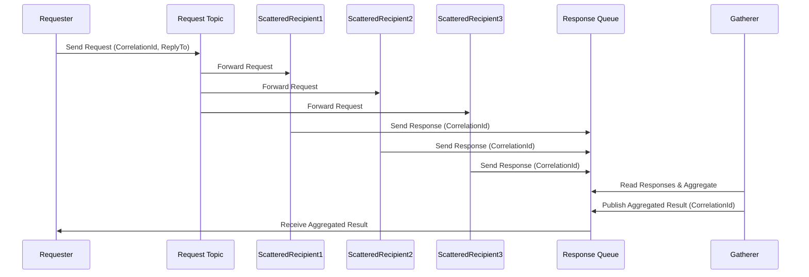
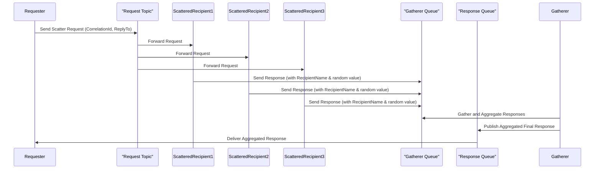

# Hands-on Lab: Scatter-Gather Messaging Pattern

## Overview

In this lab, you will build a **distributed messaging system** following the Scatter-Gather pattern using **Azure Service Bus Emulator** and C# console applications.

### Lab Components

We will create the following components:

1. **Gatherer**: A C# console application that acts as the gatherer, receiving responses from the scattered recipients and aggregating them into a final result.
2. **Requester**: A C# console application that acts as the requester, initiating the process by sending a request message to a topic.
3. **ScatteredRecipient1**: A C# console application that acts as the first scattered recipient, listening for requests and sending its response.
4. **ScatteredRecipient2**: A C# console application that acts as the second scattered recipient, listening for requests and sending its response.
5. **ScatteredRecipient3**: A C# console application that acts as the third scattered recipient, listening for requests and sending its response.
6. **ScateredRecipientHelper**: A C# class library that provides shared computation logic for all scattered recipients, ensuring code reusability and applying the **DRY (Don't Repeat Yourself) principle**.

This demo mimics a typical enterprise scenario where a client wants to receive responses from two or more services and use the results to meet its needs.

---

## What is the Scatter-Gather Messaging Pattern?

The **Scatter-Gather Messaging Pattern** is a design approach used when a single request needs to be sent to multiple independent processors (or recipients) concurrently, and their responses must be collected (or "gathered") to form a final aggregated result. This pattern is beneficial in distributed, parallel processing environments where performance, fault tolerance, and responsiveness are key.

### How It Works

1. **Scatter (Broadcast)**: The Requester sends one single request message to a **topic** ( publish/subscribe mechanism). Since topics can have multiple subscriptions, the same message is delivered to all subscribers.
2. **Processing by Scattered Recipients**: Each Scattered Recipient (e.g., ScatteredRecipient1, ScatteredRecipient2, ScatteredRecipient3) independently receives and processes the request. They can perform different computations, which vary based on specific responsibilities.
3. **Sending Responses**: After processing, each Scattered Recipient sends its response to a common **response queue**. The response message may include information identifying which recipient it came from and a common **CorrelationId** to link it back to the original request.
4. **Gather (Aggregation)**: The Gatherer listens on the response queue and collects all incoming responses. Once all responses are received or after a specified timeout period, the Gatherer aggregates them to produce a final, consolidated output for further processing or presentation.

### Sequence Diagram

Below is a Mermaid sequence diagram that illustrates the Scatter-Gather messaging flow:



##### Explanation

- **Scatter Phase**: The **Requester** sends a request to the **Request Topic** using a `CorrelationId` and the `ReplyTo` property, which indicates where responses should be sent.
- **Recipient Phase**: The **Request Topic** distributes the request to all subscribed recipients (ScatteredRecipient1, ScatteredRecipient2, ScatteredRecipient3). Each scattered recipient processes the request independently and sends its response to the shared **Response Queue**.
- **Gather Phase**: The **Gatherer** listens on the **Response Queue**. It collects and aggregates the responses received from all scattered recipients. Instead of sending the aggregated result directly to the Requester over a separate channel, the Gatherer publishes the final aggregated message back onto the same **Response Queue**, using the same `CorrelationId`.
- **Final Reception**: Finally, the **Requester**, which is also listening to the **Response Queue**, receives the aggregated result. This approach keeps the messaging consistent and leverages the response queue for both individual responses and the final consolidated result.

This design conforms well to message-oriented middleware principles, ensuring that all communication occurs through the designated queues for better decoupling and reliability.

### Key Benefits

- **Parallel Processing**: All recipients can process the request concurrently, reducing the time to complete the overall workload.
- **Fault Isolation**: If one recipient fails or experiences a delay, the others can still return their responses, improving the system's resilience.
- **Scalability**: The pattern naturally supports scaling out, as adding more recipients can distribute the workload further.
- **Flexibility**: Different recipients can perform varied computations on the same request, and the aggregation step can combine these diverse results meaningfully.

---

## Objectives

By completing this lab, you will:

- **Understand the Scatter-Gather Pattern**:
  - Grasp how a single request can be distributed (scattered) to multiple recipients and how their responses are aggregated (gathered) to produce a consolidated output.
- **Configure the Azure Service Bus Emulator**:
  - Set up topics and queues to simulate a real-world distributed messaging environment.
- **Develop Distributed Messaging Components**:
  - **Requester**: Build a console application that initiates the request by publishing a message to a topic with the appropriate metadata (e.g., `CorrelationId` and `ReplyTo`).
  - **Scattered Recipients**: Create multiple console applications that subscribe to the topic, process the request concurrently, and send individual responses to a common response queue.
  - **Gatherer**: Construct a console application that listens on the response queue, aggregates the scattered responses, and publishes the final, consolidated result back to the response queue.
- **Implement Publish/Subscribe and Aggregation Techniques**:
  - Gain hands-on experience with topics and subscriptions in the Azure Service Bus.
  - Learn how to use correlation identifiers to associate scattered responses with their originating request.
  - Observe how the Gatherer aggregates results from multiple sources, highlighting the pattern's effectiveness in parallel processing scenarios.
- **Explore Key Benefits of the Pattern**:
  - Improve system scalability through parallel processing.
  - Enhance fault isolation by ensuring that individual recipient failures do not affect overall processing.
  - Achieve flexibility by leveraging distributed messaging to integrate multiple processing services.
- **Develop Practical Skills for Asynchronous Message Processing**:
  - Understand how to design systems using asynchronous communication mechanisms to improve the robustness and responsiveness of your applications.
  - Learn to utilize Azure Service Bus capabilities for building enterprise-grade distributed solutions.

---

## Prerequisites

- [.NET SDK 8.0 or later](https://dotnet.microsoft.com/download)
- A text editor or IDE such as [Visual Studio Code](https://code.visualstudio.com/) or [Visual Studio](https://visualstudio.microsoft.com/) (any edition).
- [Docker Desktop](https://www.docker.com/products/docker-desktop)
- [Azure Service Bus Emulator](https://github.com/Azure/azure-service-bus-emulator-installer)

---

## Lab Steps

### Step 1 – Configure the Azure Service Bus Emulator

First, we must set up the queues on your local Service Bus Emulator.

1. **Update the Emulator's `config.json` File**:

   - **Locate the `config.json` file**: This file is found in the local repository folder of the Azure Service Bus Emulator Installer under the following path: `{local-emulator-repository-folder}\ServiceBus-Emulator\Configu\config.json`.

   - **Add the Request and Reply Queues**: Update the queues section to contain the definitions for both the request and reply queues. Your updated `config.json` file should look similar to the following:

     ```json
     {
       "UserConfig": {
         "Namespaces": [
           {
             "Name": "sbemulatorns",
             "Queues": [
               {
                 "Name": "message-patterns.scatter-gather.gather",
                 "Properties": {
                   "DeadLetteringOnMessageExpiration": false,
                   "DefaultMessageTimeToLive": "PT1H",
                   "DuplicateDetectionHistoryTimeWindow": "PT20S",
                   "ForwardDeadLetteredMessagesTo": "",
                   "ForwardTo": "",
                   "LockDuration": "PT1M",
                   "MaxDeliveryCount": 3,
                   "RequiresDuplicateDetection": false,
                   "RequiresSession": false
                 }
               },
               {
                 "Name": "message-patterns.scatter-gather.response",
                 "Properties": {
                   "DeadLetteringOnMessageExpiration": false,
                   "DefaultMessageTimeToLive": "PT1H",
                   "DuplicateDetectionHistoryTimeWindow": "PT20S",
                   "ForwardDeadLetteredMessagesTo": "",
                   "ForwardTo": "",
                   "LockDuration": "PT1M",
                   "MaxDeliveryCount": 3,
                   "RequiresDuplicateDetection": false,
                   "RequiresSession": false
                 }
               }
             ],
     
             "Topics": [
               {
                 "Name": "message-patterns.scatter-gather.request",
                 "Properties": {
                   "DefaultMessageTimeToLive": "PT1H",
                   "DuplicateDetectionHistoryTimeWindow": "PT20S",
                   "RequiresDuplicateDetection": false
                 },
                 "Subscriptions": [
                   {
                     "Name": "recipient-1",
                     "Properties": {
                       "DeadLetteringOnMessageExpiration": false,
                       "DefaultMessageTimeToLive": "PT1H",
                       "LockDuration": "PT1M",
                       "MaxDeliveryCount": 3,
                       "ForwardDeadLetteredMessagesTo": "",
                       "ForwardTo": "",
                       "RequiresSession": false
                     }
                   },
                   {
                     "Name": "recipient-2",
                     "Properties": {
                       "DeadLetteringOnMessageExpiration": false,
                       "DefaultMessageTimeToLive": "PT1H",
                       "LockDuration": "PT1M",
                       "MaxDeliveryCount": 3,
                       "ForwardDeadLetteredMessagesTo": "",
                       "ForwardTo": "",
                       "RequiresSession": false
                     }
                   },
                   {
                     "Name": "recipient-3",
                     "Properties": {
                       "DeadLetteringOnMessageExpiration": false,
                       "DefaultMessageTimeToLive": "PT1H",
                       "LockDuration": "PT1M",
                       "MaxDeliveryCount": 3,
                       "ForwardDeadLetteredMessagesTo": "",
                       "ForwardTo": "",
                       "RequiresSession": false
                     }
                   }
                 ]
               }
             ]
           }
         ],
         "Logging": {
           "Type": "File"
         }
       }
     }
     ```

     > **Explanation of `config.json` Settings**
     >
     > **Namespace, Queue, and Topic Definitions**
     >
     > - `Namespaces`: Represent logical groupings for queues and topics. In the local emulator, the only acceptable value is `sbemulators`. All queues and topics under this namespace will inherit their configuration rules.
     > - `Queues`: This array lists the individual queues created under the namespace. In our setup, we define two queues:
     >   - `message-patterns.scatter-gather.gather`
     >   - `message-patterns.scatter-gather.response`
     > - `Topics`: This array lists the individual topics and their subscriptions under the namespace. In our setup, we define the following topics and subscriptions.
     >   - `message-patterns.scatter-gather.request`
     >     - `recipient-1`
     >     - `recipient-2`
     >     - `recipient-3`
     >
     >
     > **Queue Properties**
     >
     > Each queue has a set of properties defined under `Properties`. Here is what each one means:
     >
     > - `DeadLetteringOnMessageExpiration`
     >
     >   This determines whether messages that expire (i.e., exceed their Time-to-Live) are automatically moved to the dead-letter queue. In our config, The Setting is false, which means expired messages will be discarded rather than forwarded to the dead-letter sub-queue.
     >
     > - `DefaultMessageTimeToLive`
     >
     >   This specifies a message's default duration in the queue before it expires if not processed. In our config, `PT1H` means each message will live for 1 hour (using ISO 8601 duration format).
     >
     > - `DuplicateDetectionHistoryTimeWindow`
     >
     >   This determines the window of time during which duplicate messages (based on a message ID) are detected. In our config, `PT20S` means duplicate detection is performed for 20 seconds after receiving a message.
     >
     > - `ForwardDeadLetteredMessagesTo`
     >
     >   If set, any dead-lettered messages are automatically forwarded to another queue. In our config, this is empty, so no forwarding is set up for the dead-letter messages.
     >
     > - `ForwardTo`
     >
     >   This specifies a queue or topic to which messages are forwarded automatically upon arrival. In our config, this is empty, meaning no auto-forwarding is performed.
     >
     > - `LockDuration`
     >
     >   This sets the duration for which a message is locked for processing after being received. This prevents multiple consumers from processing the same message simultaneously. In our config, `PT1M` means the lock lasts for 1 minute.
     >
     > - `MaxDeliveryCount`
     >
     >   This defines the maximum number of times a message delivery can be attempted before it is dead-lettered. In our config, this is set to 3, which means that after three failed attempts, the message is moved to the dead-letter queue.
     >
     > - `RequiresDuplicateDetection`
     >
     >   This indicates whether the queue should perform duplicate message detection. In our config, this turns off duplicate detection on these queues.
     >
     > - `RequiresSession`
     >
     >   This specifies whether the queue requires session-aware processing (grouping related messages together). In our config, this is set to `false`, meaning that session-based message grouping is not enforced.
     >
     > **Topics**
     >
     > The `message-patterns.scatter-gather.request` topic has the following `Properties` values:
     >
     > - `DefaultMessageTimeToLive`
     >
     >   This specifies a message's default duration in the queue before it expires if not processed. In our config, `PT1H` means each message will live for 1 hour (using ISO 8601 duration format).
     >
     > - `DuplicateDetectionHistoryTimeWindow`
     >
     >   This determines the window of time during which duplicate messages (based on a message ID) are detected. In our config, `PT20S` means duplicate detection is performed for 20 seconds after receiving a message.
     >
     > - `RequiresDuplicateDetection`
     >
     >   This indicates whether the queue should perform duplicate message detection. In our config, this turns off duplicate detection on these queues.
     >
     > **Subscriptions**
     >
     > Each queue has a set of properties defined under `Properties`. Here is what each one means:
     >
     > - `DeadLetteringOnMessageExpiration`
     >
     >   This determines whether messages within the subscription that expire (i.e., exceed their Time-to-Live) are automatically moved to the dead-letter queue. In our config, The Setting is false, which means expired subscription messages will be discarded rather than forwarded to the dead-letter sub-queue.
     >
     > - `DefaultMessageTimeToLive`
     >
     >   This specifies a message's default duration in the queue before it expires if not processed. In our config, `PT1H` means each message will live for 1 hour (using ISO 8601 duration format).
     >
     > - `LockDuration`
     >
     >   This sets the duration for which a message is locked for processing after being received. This prevents multiple consumers from processing the same message simultaneously. In our config, `PT1M` means the lock lasts for 1 minute.
     >
     > - `MaxDeliveryCount`
     >
     >   This defines the maximum number of times a message delivery can be attempted before it is dead-lettered. In our config, this is set to 3, which means that after three failed attempts, the message is moved to the dead-letter queue.
     >
     > - `ForwardDeadLetteredMessagesTo`
     >
     >   If set, any dead-lettered messages are automatically forwarded to another queue. In our config, this is empty, so no forwarding is set up for the dead-letter messages.
     >
     > - `ForwardTo`
     >
     >   This specifies a queue or topic to which messages are forwarded automatically upon arrival. In our config, this is empty, meaning no auto-forwarding is performed.
     >
     > - `RequiresSession`
     >
     >   This specifies whether the queue requires session-aware processing (grouping related messages together). In our config, this is set to `false`, meaning that session-based message grouping is not enforced.
     >
     > **Logging**
     >
     > This configures the logging mechanism for the Service Bus Emulator. In our configuration, this is set to `"Type": "File"` (the only supported option in the emulator), which means that all logs will be written to a file. This helps in troubleshooting and audit purposes.

2. **Start the Service Bus Emulator**

   - Follow the instructions for your operating system as detailed in the Azure Service Bus Emulator Installer repository. This repository includes OS-specific instructions for installing/starting the emulator.

### Step 2 – Build the Requester Console Application

In this step, you will create and build the Requester application for the Scatter-Gather lab. The Requester publishes a scatter request message to the Service Bus topic and then waits for responses on the designated response queue.

#### 2.1 Create the Project

1. **Open Your IDE**: Use Visual Studio or Visual Studio Code.

2. **Create a New Console Application Project**: Name the project **Requester**.

3. **Install Required NuGet Packages**: Open a terminal in your project directory and execute:

   ```bash
   dotnet add package Azure.Messaging.ServiceBus
   ```

   This package provides the functionality for interacting with Azure Service Bus.

#### 2.2 Build the Requester Logic

Now that your project is set up, let's build the Requester logic.

1. **Using Directives**:

   Add the following directives at the top of your `Program.cs` file.

   ```c#
   using Azure.Messaging.ServiceBus;
   ```

   This namespace brings in the necessary classes for working with Service Bus (such as `ServiceBusClient`, `ServiceBusSender`, and `ServiceBusProcessor`).

2. **Connection Strings & Queue Names**

   Define constants for your connection string, topic, and queue names:

   ```c#
   const string connectionString = "Endpoint=sb://127.0.0.1;SharedAccessKeyName=RootManageSharedAccessKey;SharedAccessKey=SAS_KEY_VALUE;UseDevelopmentEmulator=true;";
   const string requestTopicName = "message-patterns.scatter-gather.request";
   const string responseQueueName = "message-patterns.scatter-gather.response";
   ```

   - **connectionString**: Contains the information required to connect to the local Azure Service Bus Emulator.
   - **requestTopicName**: The topic to which the Requester publishes the scatter request.
   - **responseQueueName**: The queue from which the Requester will receive the aggregated responses.

3. **Send Request to Topic**

   We will create the `SendRequestAsync()` method to send a scatter request message by publishing it on the request topic.

   ```c#
   static async Task SendRequestAsync()
   {
   
   	Console.WriteLine("Press any key to start the scatter-gather process...");
   	Console.ReadKey(true);
   
   	// Create a Service Bus client and sender
   	await using ServiceBusClient serviceBusClient = new(connectionString);
   	await using ServiceBusSender serviceBusSender = serviceBusClient.CreateSender(requestTopicName);
   
   	// Send a scatter request message
   	ServiceBusMessage message = new("Scatter Request");
   	await serviceBusSender.SendMessageAsync(message);
   
   	Console.WriteLine("Scatter Request sent.");
   
   }
   ```

   - **User Prompt**: The application waits for a key press to start.
   - **ServiceBusClient & Sender**: A `ServiceBusClient` is created using the connection string, and then a sender is created for the `requestTopicName`.
   - **Message Creation & Sending**: A simple message with the body `"ScatterRequest"` is created and sent to the topic.
   - **Logging**: Displays confirmation that the scatter request was sent.

4. **Receive Response**

   We will create the `ReceiveResponse()` method to listen for responses on the response queue and print those results.

   ```c#
   static async Task ReceiveResponse()
   {
   
   	// Create a Service Bus client and processor
   	await using ServiceBusClient serviceBusClient = new(connectionString);
   	await using ServiceBusProcessor serviceBusProcessor = serviceBusClient.CreateProcessor(responseQueueName);
   
   	// Register the message handler
   	serviceBusProcessor.ProcessMessageAsync += args =>
   	{
   		Console.WriteLine($"Received response: {args.Message.Body}");
   		return Task.CompletedTask;
   	};
   
   	// Register the error handler
   	serviceBusProcessor.ProcessErrorAsync += args =>
   	{
   		Console.WriteLine($"Error: {args.Exception.Message}");
   		return Task.CompletedTask;
   	};
   
   	// Start processing messages
   	await serviceBusProcessor.StartProcessingAsync();
   
   	// Wait for user input to stop the receiver
   	Console.WriteLine("Press any key to stop the receiver...");
   	Console.ReadKey();
   	await serviceBusProcessor.StopProcessingAsync();
   
   	Console.WriteLine("Receiver stopped.");
   	Console.ReadKey(true);
   
   }
   ```

   - **ServiceBusClient & Processor**: A new `ServiceBusClient` is instantiated, and a processor is created for `responseQueueName` to receive messages.
   - **Message Handler**: The `ProcessMessageAsync` event is wired up to print out the body of each message received.
   - **Error Handler**: Any errors during processing are logged to the console.
   - **Processor Start/Stop**: The processor begins listening for messages and stops when a key is pressed, ensuring a graceful shutdown.

5. **Calling `SendRequestAsync()` and `ReceiveResposne()`**

   At the top level of your code (or inside of your `Main` method if not using top-level statements), call the two methods in sequence:

   ```c#
   await SendRequestAsync();
   await ReceiveResponse();
   ```

   This sequence of calls starts by sending the scatter request and then begins the process of listening for responses once the request is sent.

### Step 3 – Create the Scattered Recipient Helper Library

In this step, you will create a class library that encapsulates the common computation logic used by all scattered recipients. This helper library is designed to implement the DRY (Don't Repeat Yourself) principle by providing shared methods that the scattered recipient application can use to call for processing requests. With this library, you will avoid duplicating code across multiple projects, making your solution cleaner and easier to maintain.

#### 3.1 Create the Project

1. **Open Your IDE**: Use Visual Studio, Visual Studio Code,  or your favorite C# IDE.

2. **Create a new Class Library Project**:

   - In Visual Studio

     - Go to **File > New > Project**.
     - Select **Class Library (.NET Core)**.
     - Name the project **ScatteredRecipientHelper**.

   - In Visual Studio Code or via the command line, run:

     ```bash
     dotnet new classlib -n ScatteredReceipientHelper
     ```

   This command creates a new class library project with a default class file (typically `Class1.cs`).

3. **Install Required NuGet Packages**: Open a terminal in your project directory and execute:

   ```bash
   dotnet add package Azure.Messaging.ServiceBus
   ```

   This package provides the functionality for interacting with Azure Service Bus.

#### 3.2 Build the Helper Logic

Replace the default class with the default class with the following code in a file named `ScatteredRequestHelper.cs`:

```c#
using Azure.Messaging.ServiceBus;

namespace ScatteredRecipientHelper;

public static class ScatteredRequestHelper
{

	public static async Task ProcessScatteredRequests(
		string recipientName,
		string serviceBusConnectionString,
		string scatterTopicName,
		string recipientSubscriptionName,
		string gathererQueueName)
	{

		Random random = new();

		// Create a ServiceBusClient to be able to connect to the Service Bus namespace
		await using ServiceBusClient serviceBusClient = new(serviceBusConnectionString);

		// Create a ServiceBusProcessor in order to receive the requests
		await using ServiceBusProcessor requestProcessor = serviceBusClient.CreateProcessor(scatterTopicName, recipientSubscriptionName);

		// Create a ServiceBusSender in order to send the response
		await using ServiceBusSender responseSender = serviceBusClient.CreateSender(gathererQueueName);

		// Add an event handler to process messages
		requestProcessor.ProcessMessageAsync += async args =>
		{
			string body = args.Message.Body.ToString();
			Console.WriteLine($"Received message: {body}");

			// Send a response message to the gatherer queue
			ServiceBusMessage responseMessage = new("Scatter Recipient Response");
			responseMessage.ApplicationProperties["RecipientName"] = recipientName;
			responseMessage.ApplicationProperties["Response"] = random.Next(1, 100);
			await responseSender.SendMessageAsync(responseMessage);
			Console.WriteLine($"Sent recipient response message: {responseMessage.Body}");

			await args.CompleteMessageAsync(args.Message);
		};

		// Add an event handler to process any errors
		requestProcessor.ProcessErrorAsync += args =>
		{
			Console.WriteLine(args.Exception.ToString());
			return Task.CompletedTask;
		};

		// Start processing
		await requestProcessor.StartProcessingAsync();
		Console.WriteLine();
		Console.WriteLine($"{recipientName} is listening for messages; press any key to stop...");
		Console.ReadKey(true);

		// Stop processing
		await requestProcessor.StopProcessingAsync();

	}

}
```

> **Explanation**
>
> 1. **Using Directives and Namespace Declaration**:
>    - The code begins with the necessary `using` statement for the Azure Service Bus operations.
>    - This class is placed instead of the `ScatteredReceipientHelper` namespace.
> 2. **Static Class Declaration**:
>    - `ScatateredRequestHelper` is declared a `static` class so its methods can be invoked without creating an instance. This is useful for shared helper methods.
> 3. **ProcessScatteredRequests Method**
>    - **Parameters**:
>      - `recipientName`: Identifies the recipient instance.
>      - `serviceBusConnectionString`: The connection string for the Service Bus.
>      - `scatterTopicName`: The topic from which the recipient subscribes to incoming requests.
>      - `recipientSubscriptionName`: The subscription for this particular recipient on the topic.
>      - `gathererQueueName`: The queue where responses are sent.
>    - **Random Number Generator**: A `Random` object is instantiated to simulate processing logic.
>    - **Creating the ServiceBusClient**: A client is created to connect to the Service Bus namespace using the provided connection string.
>    - **Processor Creation**: A `ServiceBusProcessor` is created to receive messages from the specific topic subscription.
>    - **Response Sender**: A `ServiceBusSender` is initialized to send out responses to the the gather queue.
>    - **Processing Messages**: An event handler is attached to the `ProcessMessageAsync` to process each incoming message:
>      - It logs the received message.
>      - It creates a response message and attaches application properties such as the `RecipientName` and a randomized `Response`.
>      - It sends the response message.
>      - It completes the message processing using `CompleteMessageAsync`.
>    - **Error Handling**: An error handler is provided via `ProcessErrorAsync`, which logs any exceptions.
>    - **Start and Stop Processing**: The processor is started, and the application waits for a key press to stop processing gracefully.
> 4. **Finalization**: The method ensures that the message processing is safely stopped after a key press, allowing the application to exit gracefully.

### Step 4 - Build the Scattered Recipient Console Applications

In this step, you will create three console applications—**ScatteredRecipient1**, **ScatteredRecipient2**, and **ScatteredRecipient3**—that listen for scatter requests on distinct topic subscriptions, process those requests, and reply to the gather queue using the shared logic from the `ScatteredRecipientHelper` library.

Each recipient project will:

1. It will be created as a new console application.
2. Include a reference to the `ScatteredRecipientHelper` class library.
3. This file contains code that calls `ScatteredRequestHelper.ProcessScatteredRequests` passes in configuration settings specific to that recipient (e.g., recipient and subscription names).

Below is the detailed breakdown.

#### 4.1 Building ScatteredRecipient1

1. **Create the Project**:

   - Open your IDE (Visual Studio or Visual Studio Code).
   - Create a new Console Application project named **ScatteredRecipient1**.

2. **Add a Reference to the Helper Library**:

   - In Visual Studio, right-click the **ScatteredReceipient1** project, select **Add > Reference...**, and add the **ScatteredRecipientHelper** project.

   - From the command line, navigate to the **ScatteredRecipient1** project folder and run.

     ```bash
     dotnet add reference ../ScatteredRecipientHelper/ScatteredRecipientHelper.csproj
     ```

3. **Build the Code**

   Replace the default code in `Program.cs` with the following:

   ```c#
   using ScatteredRecipientHelper;
   
   const string recipientName = "Scattered Recipient 1";
   const string connectionString = "Endpoint=sb://127.0.0.1;SharedAccessKeyName=RootManageSharedAccessKey;SharedAccessKey=SAS_KEY_VALUE;UseDevelopmentEmulator=true;";
   const string topicName = "message-patterns.scatter-gather.request";
   const string subscriptionName = "recipient-1";
   const string gathererQueueName = "message-patterns.scatter-gather.gather";
   
   await ScatteredRequestHelper.ProcessScatteredRequests(
   	recipientName,
   	connectionString,
   	topicName,
   	subscriptionName,
   	gathererQueueName);
   ```

   **Explanation**:

   - **Using Directive**: Imports the `ScatteredRecipientHelper` namespace so the helper methods can be used.
   - **Configuration Constants**:
     - `recipientName` identifies this instance.
     - `connectionString` holds the Azure Service Bus connection details.
     - `topicName` corresponds to the scatter request topic.
     - `subscriptionName` is set to `"recipient-=1"` to ensure this application subscribes to the correct messages.
     - `gathererQueueName` specifies where the response should be sent.
   - **Processing Call**: The helper method `ProcessScatteredRequests` is invoked with the above parameters. This method sets up message processing by listening on the specified topic subscription and sending responses to the gathered queue.

   #### 4.2 Build ScatteredRecipient2

   1. **Create the Project**: Create a new Console Application project named `ScatteredRecipient2`.

   2. **Add a Reference**: Follow the same steps to add a reference to the **ScatteredRecipientHelper** class library.

   3. **Build the Code**:

      Replace the default code in `Program.cs` with:

      ```c#
      using ScatteredRecipientHelper;
      
      const string recipientName = "Scattered Recipient 2";
      const string connectionString = "Endpoint=sb://127.0.0.1;SharedAccessKeyName=RootManageSharedAccessKey;SharedAccessKey=SAS_KEY_VALUE;UseDevelopmentEmulator=true;";
      const string topicName = "message-patterns.scatter-gather.request";
      const string subscriptionName = "recipient-2";
      const string gathererQueueName = "message-patterns.scatter-gather.gather";
      
      await ScatteredRequestHelper.ProcessScatteredRequests(
      	recipientName,
      	connectionString,
      	topicName,
      	subscriptionName,
      	gathererQueueName);
      ```

      **Explanation**:

      - The code structure is identical to **ScatteredRecipient1**.
      - Only the values for `recipientName` and `subscriptionName` have changed (now `"Scattered Recipient 2"` and `"recipient-2"`, respectively) to ensure that messages are routed to this recipient independently.

   #### 4.3 Build ScatteredRecipient3

   1. **Create the Project**: Create a new Console Application project named `ScatteredRecipient3`.

   2. **Add a Reference**: Follow the same steps to add a reference to the **ScatteredRecipientHelper** class library.

   3. **Build the Code**:

      Replace the default code in `Program.cs` with:

      ```c#
      using ScatteredRecipientHelper;
      
      const string recipientName = "Scattered Recipient 3";
      const string connectionString = "Endpoint=sb://127.0.0.1;SharedAccessKeyName=RootManageSharedAccessKey;SharedAccessKey=SAS_KEY_VALUE;UseDevelopmentEmulator=true;";
      const string topicName = "message-patterns.scatter-gather.request";
      const string subscriptionName = "recipient-3";
      const string gathererQueueName = "message-patterns.scatter-gather.gather";
      
      await ScatteredRequestHelper.ProcessScatteredRequests(
      	recipientName,
      	connectionString,
      	topicName,
      	subscriptionName,
      	gathererQueueName);
      ```

      **Explanation**:

      - Again, the logic is unchanged except that we update `recipientName` to `"Scattered Recipient 3"` and `subscriptionName` to `"recipient-3"`.
      - This uniquely identifies this console application's subscription in the Service Bus, allowing it to process its own share of scattered requests.

   #### Summary

   In **Step 4**, you created three scattered recipient applications:

   - **ScatteredRecipient1**: Listens on subscription `recipient-1` and processes messages using the shared helper method.
   - **ScatteredRecipient2**: Listens on subscription `recipient-2`.
   - **ScatteredRecipient3**L Listens on subscription `recipient-3`.

   Each application references the `ScatteredRecipientHelper` library, ensuring all recipients use the same standard logic for handling scatter requests.

### Step 5 – Build the Gatherer Console Application

In this Scatter-Gather pattern, the gatherer collects individual responses from scattered recipients, aggregates them, and then sends a final consolidation response. In this step, you will create a console application that:

- **Gathers responses**: It listens to the gatherer queue and collects messages until a target (in this demo, three responses) is reached.
- **Aggregates responses**: Processes the collected responses (here, by ordering a numeric property) to determine the best response.
- **Sends a final response**: Publishes the aggregated result to the designated response

#### 5.1 Create the Project

1. **Open Your IDE**: Use Visual Studio or Visual Studio Code.

2. **Create a New Console Application Project**: Name the project **Gatherer**.

3. **Install the Required NuGet Package**: In the terminal for your project directory, run:

   ```bash	
   dotnet add package Azure.Messaging.ServiceBus
   ```

   This package provides all the Service Bus functionality you need.

#### 5.2 Build the Gatherer Logic

Below is the complete code for the Gatherer application, with the key sections broken down.

1. **Define Configuration Constants and Begin Processing**

   ```c#
   using Azure.Messaging.ServiceBus;
   
   // Set your connection string and the names of the Service Bus entities.
   const string connectionString = "Endpoint=sb://127.0.0.1;SharedAccessKeyName=RootManageSharedAccessKey;SharedAccessKey=SAS_KEY_VALUE;UseDevelopmentEmulator=true;";
   const string gathererQueueName = "message-patterns.scatter-gather.gather";
   const string responseQueueName = "message-patterns.scatter-gather.response";
   
   // Gather responses from the gatherer queue.
   List<ServiceBusReceivedMessage> gatheredResponses = await GatherResponsesAsync();
   
   // Aggregate the gathered responses to find the best response.
   ServiceBusReceivedMessage? aggregatedResponse = AgregateResponses(gatheredResponses);
   
   // Send the aggregated response to the response queue.
   await SendResponseAsync(aggregatedResponse);
   
   Console.WriteLine("Done");
   Console.ReadKey(true);
   ```

   **Explanation**:

   - Three constants are defined:
     - **connectionString**: For connecting to the local Azure Service Bus Emulator.
     - **gathererQueueName**: The queue from which the gatherer reads responses from scattered recipients
     - **responseQueueName**: The queue where the aggregated (final) response will be sent.
   - The main flow of the application is:
     - **GatherResponsesAsync()**: Collects responses until there are three messages.
     - **AgregateResponses(...)**: Processes these messages and chooses the best one.
     - **SendResponseAsync(...)**: Sends the final aggregated message.
   - Finally, the application writes "Done" to the console and waits for a key press.

2. **Implement the `GatherResponsesAsync()` Method**

   ```c#
   static async Task<List<ServiceBusReceivedMessage>> GatherResponsesAsync()
   {
   	Console.WriteLine("Gathering responses...");
   	await using ServiceBusClient serviceBusClient = new(connectionString);
   	await using ServiceBusReceiver serviceBusReceiver = serviceBusClient.CreateReceiver(gathererQueueName);
   	List<ServiceBusReceivedMessage> gatheredResponses = new List<ServiceBusReceivedMessage>();
   	while (gatheredResponses.Count < 3)
   	{
   		ServiceBusReceivedMessage response = await serviceBusReceiver.ReceiveMessageAsync();
   		gatheredResponses.Add(response);
   		await serviceBusReceiver.CompleteMessageAsync(response);
   	}
   	return gatheredResponses;
   }
   ```

   **Explanation**:

   - **ServiceBusClient and ServiceBusReceiver**: The code creates a client and receives to listen to the `gathererQueueName` queue.
   - **Message Gathering Loop**: It keeps receiving messages until three responses have been gathered.
   - **Completion**: Each received message is marked as completed using `CompleteMessageAsync so that it can be removed from the queue.
   - **Return Value**: The method returns a list of gathered responses.

3. **Implement the `AgregatedResponses()` Method**

   ```c#
   static ServiceBusReceivedMessage? AgregateResponses(List<ServiceBusReceivedMessage> gatheredResponses)
   {
   	Console.WriteLine("Aggregating responses...");
   	return gatheredResponses
   		.Where(msg => msg.ApplicationProperties.ContainsKey("Response"))
   		.OrderBy(msg => (int)msg.ApplicationProperties["Response"])
   		.FirstOrDefault();
   }
   ```

   > **Explanation**:
   >
   > - **Aggregation Logic**: This method inspects the list of gathered responses.
   > - **Filtering & Ordering**: It filters messages that contain the "Response" property and orders them by the numeric value in that property.
   > - **Selection**: The aggregated response is chosen from the first (i.e., the best message according to the order).
   > - **Return Value**: Returns the aggregated response (or `null` if no valid response exists).

4. **Implement the `SendResponseAsync` Method**

   ```c#
   static async Task SendResponseAsync(ServiceBusReceivedMessage? aggregatedResponse)
   {
   	Console.WriteLine("Sending response...");
   	await using ServiceBusClient serviceBusClient = new(connectionString);
   	await using ServiceBusSender responseSender = serviceBusClient.CreateSender(responseQueueName);
   
   	ServiceBusMessage responseMessage = aggregatedResponse is null
   		? new("No response received")
   		: new($"The best response was from `{aggregatedResponse.ApplicationProperties["RecipientName"]}` with a response of `{aggregatedResponse.ApplicationProperties["Response"]}`");
   
   	await responseSender.SendMessageAsync(responseMessage);
   }
   
   // Create a Service Bus client, processor, and sender
   await using ServiceBusClient serviceBusClient = new(connectionString);
   await using ServiceBusProcessor gathererProcessor = serviceBusClient.CreateProcessor(gathererQueueName);
   
   await using ServiceBusSender responseSender = serviceBusClient.CreateSender(responseQueueName);
   ```

   > **Explanation**:
   >
   > - **ServiceBusClient and ServiceBusSender**: A new client and sender are created to send messages to the `responseQueueName`.
   > - **Constructing the Final Message**: The code checks if the `aggregatedResponse` is `null`.
   >   - If `null`, it creates a message indicating that no response was received.
   >   - Otherwise, it builds a message that reports which recipient produced the best response and its value.
   > - **Sending the Message**: The constructed final message is sent to the request queue with `SendMessageAsync`.

#### Summary

In **Step 5**, you built the Gatherer console application step by step. This application completes the Scatter-Gather messaging pattern by combining the responses from multiple scattered recipients and publishing a final consolidating response.

### Step 6 - Run the Scatter-Gather Lab

In this final step, you will run all components of your Scatter-Gather lab:

- **Scattered Recipients (ScatteredRecipient1, ScatteredRecipient2, ScatteredRecipient3)**: These applications will listen on their respective topic subscriptions for scatter request messages, process those requests using shared helper logic, and send their individual responses to the **gatherer queue**.
- **Gatherer**: This application listens on the **gatherer queue**, gathers the individual responses, aggregates them (choosing the best response based on your aggregation logic), and then sends the final aggregated response to the **response queue**.
- **Requester**: This application initiates the process by publishing a scatter request message to the **request topic**. After sending the request, it will be listened to in the **response queue** for the aggregated final response from the Gatherer.

#### Order of Operations

Follow these steps to run the lab in the proper order and see the complete end-to-end messaging flow:

1. **Start the Scattered Recipient Applications**:
   - Open three separate console windows—one for each scattered recipient (ScatteredRecipient1, ScatteredRecipient2, ScatteredRecipient3).
   - Run each console application. Each recipient will connect to the Service Bus and begin listening on its designated subscription (e.g., `recipient-1`, `recipient-2`, and `recipient-3`).
   - You should see console output indicating that each recipient is listening for messages (e.g., "Scattered Recipient 1 is listening for messages; press any key to stop...");
2. **Start the Gatherer Application**:
   - In its own console window, start the Gatherer application.
   - The Gatherer will connect to the Service Bus, begin listening on the **gatherer queue**, and output a message such as "Gathering responses...". It will wait until it collects the expected number of responses (in our demo, three messages) before aggregating them and sending the final response.
3. **Run the Requester Application**:
   - Finally, open a separate console window for the Requester application.
   - Run the Requester, and you will see a prompt: `Press any key to start the scatter-gather process...`.
   - When you press a key, the Requester publishes a scatter request message to the **request topic** and then begins listening on the **response queue** for the aggregated response.
4. **Observe the Flow and Output**:
   - **Scattered Recipients**: Upon receiving the scatter request, each recipient processes the message (simulating a computation by generating a random response) and then sends its response to the **response queue** for an aggregated response.
   - **Gatherer**: As the responses accumulate on the gatherer queue, the Gatherer aggregates them. You will see messages such as Aggregating responses. Once aggregation is complete, the final aggregated response is sent to the **response queue**.
   - **Requester**: Finally, the Requester, which is listening on the **response queue**, will display the aggregated final response on its console.
5. **Shutdown**:
   - Once you have verified that the messaging flow operates as expected, follow any on-screen prompts (such as pressing a key) to shut down each component gracefully.

#### Sequence Diagram

To visualize the flow, consider the following sequence diagram:



---

## Next Steps

Congratulations on completing the Scatter-Gather messaging lab! Now that you have built and run a complete distributed messaging solution using Azure Service Bus Emulator, here are a few directions to continue your learning and further enhance your solution:

- **Enhance the Aggregation Logic**: Experiment with more sophisticated aggregation techniques. For example, instead of simply choosing the lowest numeric response, you might combine multiple responses (e.g., averaging values or applying weighted scoring) to produce a richer final result.
- **Implement Advanced Error Handling and Resilience**: Investigate incorporating retries, dead-lettering, or circuit breaker patterns into your components to handle transient failures better. You can also explore using cancellation tokens to manage long-running operations gracefully.
- **Scale Out and Test with Real Data**: Consider deploying your solution to Azure and using real Azure Service Bus instances. This allows you to test scalability, monitor performance metrics, and simulate real-world workloads.
- **Extend the Messaging Patterns**: Now that you are familiar with Scatter-Gather, try exploring other messaging patterns such as Request/Reply, Publish/Subscriber, or even Saga patterns for managing long-running transactions. Comparing the strengths and trade-offs of each pattern will broaden your messaging design skills.
- **Integrate with Additional Services**: Extend your solution by integrating other services (like Azure Functions, Logic Apps, or other microservices) to see how distributed messaging can coordinate workflows across a broader architecture.
- **Monitor and Log**: Introduce structured logging and telemetry (using tools such as Application Insights) to understand the system's behavior better. This is especially useful when scaling your solution or troubleshooting issues.