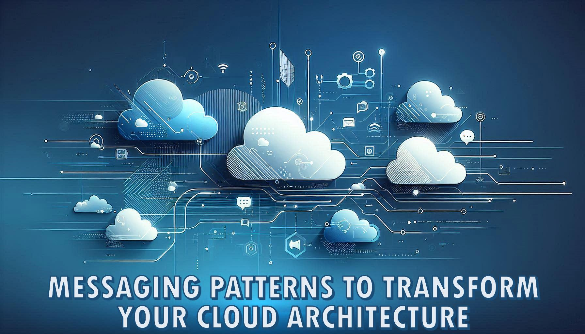

# Messaging Patterns to Transform Your Cloud Architecture

 🗣️Talk 🟢 Introductory

## Abstract
In today’s fast-evolving cloud landscape, messaging patterns are the quiet enablers behind resilient, high-performance systems. This session unlocks the secrets of these paradigms—from Point-to-Point to the innovative Saga Pattern—to empower architects and developers to design systems that scale gracefully and respond dynamically. Through hands-on implementations and vivid real-world case studies, you’ll gain technical mastery and a fresh perspective on integrating effective, future-proof messaging in your cloud solutions.

   

## Learning Objectives
- **Master Core Messaging Fundamentals:** Understand the key principles behind messaging patterns such as Publish-Subscribe, Request-Reply, and more, and learn how they form the backbone of resilient cloud architectures.
- **Implement Real-World Messaging Solutions:** Follow detailed, step-by-step demonstrations and case studies that show how to deploy these patterns effectively in production environments.
- **Transform and Elevate Your Cloud Strategy:** Gain actionable best practices to enhance system scalability, reliability, and maintainability, arming you with innovative techniques to transform your cloud applications.

## Presentations

| Event | Location | Date | Time | Room | Downloads |
|-------|:--------:|-----:|-----:|-----:|----------:|
| Jasper Engines (Private Event) | Jasper, IN | 2025-06-03 | 14:30 EDT | FRED 1 | [Slides](EventMaterials/MessagingPatterns-Jasper-DEV01-02.pptx) / [Demos](Demos/readme.md) |
| [Tulsa .NET User Group](https://www.meetup.com/tulsadevelopers-net/events/308068892) | Tulsa, OK (Virtual) | 2025-05-28 | 18:15 CDT | Virtual | [Slides](EventMaterials/MessagingPatterns-Tulsa.pptx) / [Demos](Demos/readme.md) |
| Jasper Engines (Private Event) | Jasper, IN | 2025-05-13 | 13:00 EDT | FRED 3 | [Slides](EventMaterials/MessagingPatterns-Jassper-DEV03.pptx) / [Demos](Demos/readme.md) |
| [Atlanta Cloud Conference](https://atlantacloudconference.com/) | Atlanta, GA | 2025-04-26 | 13:15 EDT | 105 | [Slides](EventMaterials/MessagingPatterns-AtlantaCloudConference2025.pptx) / [Demos](Demos/readme.md) |
| [Louisville .NET Meetup](https://www.meetup.com/louisville-dotnet/events/307268301) | Louisville, KY | 2025-04-18 | 18:30 EDT | Conference Room | [Slides](EventMaterials\MessagingPatterns-LouDotNet2025.pptx) |

Email [chadgreen@chadgreen.com](mailto:chadgreen@chadgreen.com?subject=Presentation%20Request:%20Transform%20Your%20Cloud%20Architecture%20with%20These%20Messaging%20Patterns) to have Chad present this session at your event.

## Resources
There are no additional resources for this presentation.
